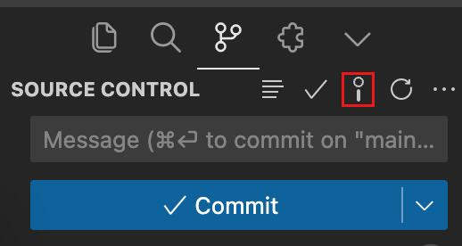

# Commit Message Helper

Commit Message Helper is a Visual Studio Code extension that generates commit messages using ChatGPT.

## Features

- Generates commit messages using OpenAI's GPT models
- Customizable API settings
- Keyboard shortcut for quick access
- Provides commit message templates
- **Supports both Git and Subversion**

## Usage

### Option 1:
> In Source Control, click the **"Generate Commit Message"** button to create a commit message based on your changes.

### Option 2:
> In the bottom bar, click the **"Commit Message Helper"** button. This will generate a commit message in a temporary file for you to review. Save the temporary file, and it will then generate the commit message in the terminal.

## Configuration

You can configure the extension in your VS Code settings:

- `commitMessageHelper.apiKey`: Your OpenAI API key
- `commitMessageHelper.customPromptTemplatePath`: Path to a custom prompt template file
- `commitMessageHelper.baseUrl`: Base URL for OpenAI API
- `commitMessageHelper.model`: OpenAI model to use for generating commit messages

## License

This project is licensed under the MIT License - see the [LICENSE](LICENSE) file for details.

## Author

iduane

## Repository

[https://github.com/iduane/commit-message-helper](https://github.com/iduane/commit-message-helper)
